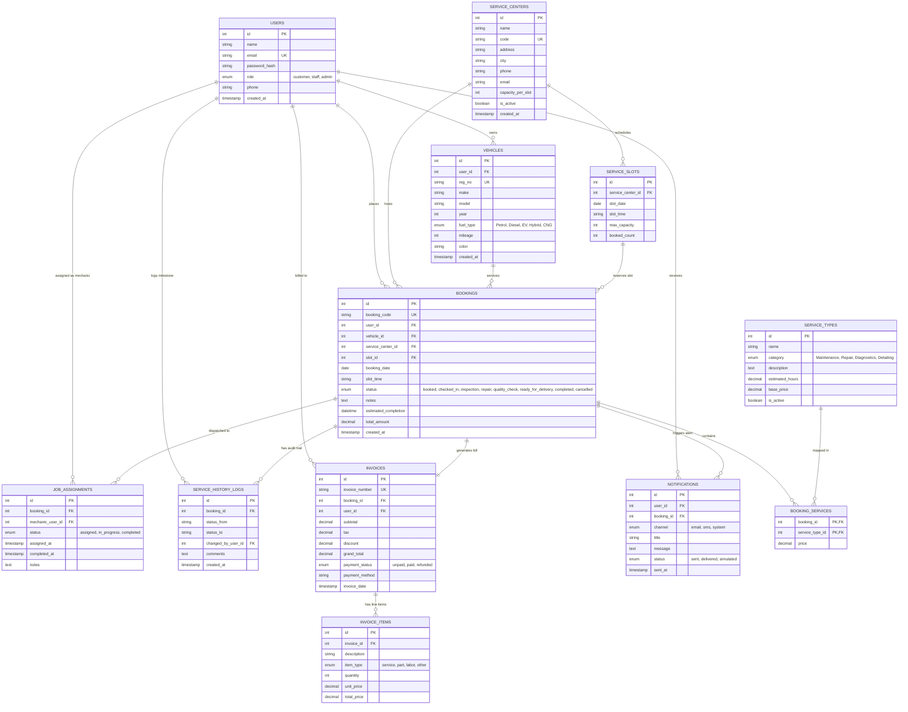

# Entity-Relationship (ER) Diagram
## Project: The Vehicle Service Booking and Tracking System
**Course**: DATABASE SYSTEMS ENGINEERING AND DISTRIBUTED BACKEND DEVELOPMENT (25CS1302E)  
**Team No**: 24 | **Section**: Sec No-2  
**Students**: Revanth Reddy (`2520030424`) & Subhash (`2520030391`)  
**Database**: `vehicle_service_db` (MySQL 8.0 Engine)

---

## 1. Mermaid Entity-Relationship Diagram

---

## 2. Relational Cardinalities & Constraints Summary

| Relationship | Cardinality | Foreign Key Constraint | Description |
|---|---|---|---|
| **USERS $\to$ VEHICLES** | 1 : N (One-to-Many) | `ON DELETE CASCADE` | One user can register multiple vehicles; deleting a user removes their vehicles. |
| **USERS $\to$ BOOKINGS** | 1 : N (One-to-Many) | `ON DELETE CASCADE` | A customer places multiple service bookings over time. |
| **VEHICLES $\to$ BOOKINGS** | 1 : N (One-to-Many) | `ON DELETE CASCADE` | Each vehicle accumulates a complete chronological service history. |
| **SERVICE_CENTERS $\to$ SLOTS** | 1 : N (One-to-Many) | `ON DELETE CASCADE` | Each station manages distinct time slots per calendar date. |
| **SERVICE_CENTERS $\to$ BOOKINGS**| 1 : N (One-to-Many) | `ON DELETE RESTRICT` | Center cannot be deleted if active bookings exist. |
| **BOOKINGS $\leftrightarrow$ SERVICE_TYPES**| N : M (Many-to-Many) | Via `BOOKING_SERVICES` composite PK | A booking can bundle multiple maintenance/repair services. |
| **BOOKINGS $\to$ JOB_ASSIGNMENTS**| 1 : N (One-to-Many) | `ON DELETE CASCADE` | A job is dispatched to a certified mechanic (`role = 'staff'`). |
| **BOOKINGS $\to$ SERVICE_HISTORY_LOGS**| 1 : N (One-to-Many) | `ON DELETE CASCADE` | Immutable audit trail tracking every milestone from Check-in to Delivery. |
| **BOOKINGS $\to$ INVOICES** | 1 : 1 (One-to-One) | `UNIQUE (booking_id)` | Each completed service generates exactly one official digital tax invoice. |
| **INVOICES $\to$ INVOICE_ITEMS**| 1 : N (One-to-Many) | `ON DELETE CASCADE` | Line items detailing specific labor charges, consumables, and OEM spare parts. |
| **USERS $\to$ NOTIFICATIONS** | 1 : N (One-to-Many) | `ON DELETE CASCADE` | Historical log of SMS and email alerts dispatched to customer/staff. |

---

## 3. Database Normalization Level (3NF / BCNF)
- **1NF (First Normal Form)**: Every table has an atomic primary key (`id` or composite PK in `booking_services`). No repeating groups.
- **2NF (Second Normal Form)**: All non-key attributes are fully functionally dependent on the complete primary key.
- **3NF (Third Normal Form)**: No transitive dependencies exist. Line item amounts (`total_price`) and tax calculations are derived through dedicated relation tables rather than redundant columns on the master entity.
